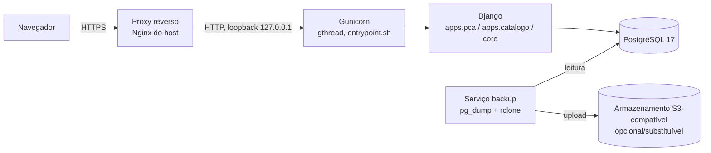

# Arquitetura

## Topologia de execução

Aplicação server-rendered clássica: navegador → proxy HTTPS → Gunicorn → Django → PostgreSQL.
Não há Redis nem fila de tarefas assíncrona no sistema — confirmado por
`grep -ri redis\|celery requirements.txt compose.yml` (retorno vazio); toda exportação e
importação roda de forma síncrona, dentro do próprio request/response.

`compose.yml` declara 3 serviços: `db` (Postgres 17, porta só em `127.0.0.1:15433`, healthcheck
`pg_isready`, volume nomeado externo), `web` (build local, bind em
`${WEB_BIND_ADDRESS}:${WEB_PORT}:8000`, healthcheck via `curl http://127.0.0.1:8000/healthz`,
monta `./templates:/app/templates:ro`) e `backup` (build de `./ops/backup`, sem porta exposta,
credenciais de armazenamento via variável de ambiente).

`entrypoint.sh` roda `python manage.py migrate --noinput` e então inicia
`gunicorn config.wsgi:application --bind 0.0.0.0:8000 --workers ${GUNICORN_WORKERS:-3}
--threads ${GUNICORN_THREADS:-4} --worker-class gthread --timeout ${GUNICORN_TIMEOUT:-60}
--max-requests 1000 --max-requests-jitter 100` — 3 workers × 4 threads = 12 slots de
concorrência, dimensionado para o pico de ~50 usuários simultâneos numa reunião de
acompanhamento (comentário do próprio `entrypoint.sh`).

## Serviço de backup

O serviço `backup` (`ops/backup/backup.sh`) roda `pg_dump --format=custom` e envia o dump via
`rclone` para um destino remoto configurado por `RCLONE_CONFIG_R2_*`/`R2_BUCKET` em
`compose.yml`. **Cloudflare R2 é só o exemplo usado em produção — não é uma dependência
obrigatória**: qualquer destino compatível com `rclone` (S3, outro provedor, disco local via
`rclone` local) funciona trocando as variáveis de ambiente. Ver
[Configuração](configuracao.md) e [Operação](operacao.md) (seção Recovery).

## Apps Django instalados

`INSTALLED_APPS` (`config/settings/base.py`): `whitenoise.runserver_nostatic`,
`core.apps.PcaAdminConfig`, `django.contrib.auth`, `django.contrib.contenttypes`,
`django.contrib.postgres`, `django.contrib.sessions`, `django.contrib.messages`,
`django.contrib.staticfiles`, `django.forms`, `django_htmx`, `simple_history`, `axes`, `core`,
`apps.catalogo`, `apps.pca`.

## Casca visual

Toda página estende `core/templates/base.html` (byte-idêntico ao da skill `dsgov`, nunca
editado), que inclui, em ordem fixa, `_skiplink.html` → `_header.html` → `_menu.html` →
`_breadcrumb.html` → `_mensagens.html` → `` → `_footer.html`. HTMX é a
exceção, não a regra: só a tela Processos (`pca:tabela`) e o modal "Registrar acompanhamento"
usam `hx-get`/`hx-post`; as demais telas recarregam a página inteira a cada troca de filtro.

**Fontes verificadas:** `compose.yml`, `Dockerfile`, `entrypoint.sh`, `ops/nginx/pca.conf`,
`ops/backup/backup.sh`, `config/settings/base.py` (`INSTALLED_APPS`), `CLAUDE.md` (seção
Architecture).
