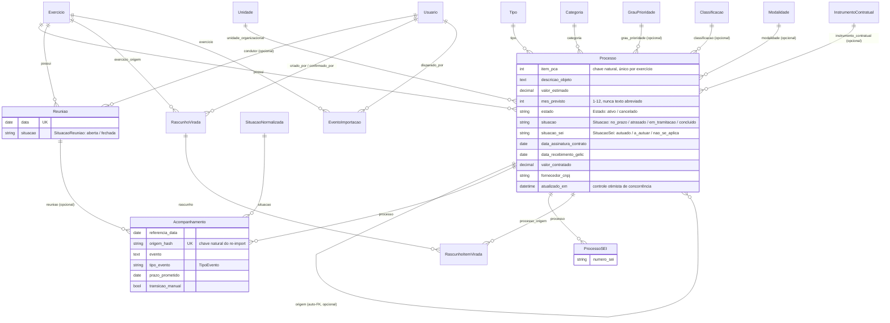

# Modelo de dados

O domínio vive em dois apps: `apps/pca` (processos, acompanhamentos, reuniões, virada de
exercício) e `apps/catalogo` (vocabulário — exercício e as 8 tabelas de catálogo). `core.Usuario`
é o modelo de autenticação. 31 migrations ao todo (`find apps core -path "*/migrations/*.py"`,
excluindo `__init__.py`).

## Diagrama de entidades

## Enums (`TextChoices`)

| Enum | Valores | Onde |
|---|---|---|
| `Estado` | `ativo`, `cancelado` | `Processo.estado` |
| `Situacao` | `no_prazo`, `atrasado`, `em_tramitacao`, `concluido` | `Processo.situacao` |
| `SituacaoSei` | `autuado`, `a_autuar`, `nao_se_aplica` | `Processo.situacao_sei` |
| `TipoEvento` | `reuniao_acompanhamento`, `gestao_riscos`, `automatico` | `Acompanhamento.tipo_evento` |
| `SituacaoReuniao` | `aberta`, `fechada` | `Reuniao.situacao` |
| `SituacaoExercicio` | `aberto`, `fechado` | `Exercicio.situacao` |

## Constraints notáveis

- `Processo`: `UniqueConstraint(fields=["exercicio", "item_pca"], name="pca_processo_exercicio_item_unico")` — o item PCA é único por exercício, não globalmente.
- `Reuniao`: `UniqueConstraint(fields=["data"], name="pca_reuniao_data_unica")` e um `UniqueConstraint` condicional (`condition=Q(situacao=SituacaoReuniao.ABERTA)`) que garante no máximo **uma** reunião aberta ao mesmo tempo.
- `ProcessoSEI`: `unique_together = ("processo", "numero_sei")` — relação 1:N entre processo e números SEI (uma célula da planilha original podia carregar 0, 1 ou vários números).
- `RascunhoVirada`: `UniqueConstraint` condicional (`confirmado_em__isnull=True`) — no máximo um rascunho pendente por par origem/destino.
- `RascunhoItemVirada`: dois `UniqueConstraint` (`rascunho`+`processo_origem`; `rascunho`+`ordem`).
- `apps/catalogo/models.py::DominioBase` (abstrata, herdada pelos 8 catálogos): `nome` único e `nome_normalizado` único, calculado em `save()` — é a chave natural usada pelo upsert idempotente do import.

## Campos derivados (nunca gravados diretamente)

`ProcessoQuerySet.para_listagem()` (`apps/pca/querysets.py`) anota, via `Subquery`/`annotate` —
nunca em Python, nunca linha a linha —, as propriedades que a antiga planilha calculava por
fórmula: `situacao_atual` (última situação normalizada informada), `prazo_vigente` (último
`prazo_prometido` não nulo), `n_reunioes`, `n_compromissos`, `n_prazos_distintos`, e
`prazo_inicial = COALESCE(prazo_entrega, primeira promessa registrada)`.

`apps/pca/regras_situacao.py` é o módulo puro (sem import de `django.db.models`) que deriva
`Processo.situacao`:

- `situacao_por_eventos()` — regra viva: reage só a fatos gravados (Tipo "Vigente" ⇒ sempre
  concluído; `data_assinatura_contrato` preenchida ⇒ concluído; `data_recebimento_gelic`
  preenchida ⇒ em tramitação); nunca deriva "atrasado" a partir de calendário.
- `situacao_inicial()` — regra de backfill/criação: chama a anterior primeiro e só cai no
  fallback `prazo_efetivo < hoje ⇒ atrasado` quando não há nenhum evento gravado
  (`prazo_efetivo = COALESCE(prazo_vigente, prazo_entrega)`).

`prazo_atual_ficha()` (`apps/pca/relatorio_movimentacao.py`) monta o quadro "Prazo atual" da
ficha do processo (a "ficha PNCP" das telas) reaproveitando `processo.prazo_efetivo`/
`situacao_efetiva`, nunca recalculando.

## Auditoria (`django-simple-history`)

`simple_history` está em `INSTALLED_APPS`; `Processo` e `Acompanhamento` declaram
`history = HistoricalRecords()`, gerando `HistoricalProcesso`/`HistoricalAcompanhamento`
automaticamente. `core.Usuario` também é registrado (ver `core/admin.py`, exigência da própria
biblioteca para modelos de usuário customizados). No Django Admin, um superusuário pode editar
ou apagar qualquer registro, inclusive linhas históricas — a trilha `simple_history` continua
automática nas telas do sistema, mas deixa de ser imutável no Admin (ver
[Segurança](seguranca.md)).

**Fontes verificadas:** `apps/pca/models.py`, `apps/catalogo/models.py`, `core/models.py`,
`apps/pca/importacao/models.py`, `apps/pca/querysets.py`, `apps/pca/regras_situacao.py`,
`apps/pca/relatorio_movimentacao.py`, `config/settings/base.py` (`INSTALLED_APPS`).
